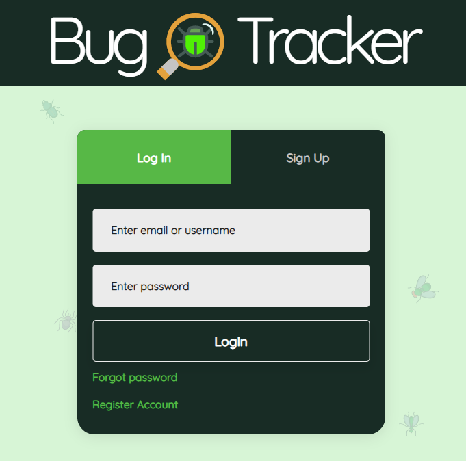

# BugTracker_v1
## Tracks Bugs and Feature Requests for You or Your Organization
## [Live Demo](https://bugtracker-davidlink.herokuapp.com/)
### Technologies:

### Features ✔️
- Login & Registration
- Cascading Permissions
- Manually Cascaded Editing
- Manually Cascaded Deletion
- Basic Error Handling
- Database Seeder

### Future Fixes? 🛠
- Using Change Streams to organize Backend / better cascading for updates
- Adding Comments
- Bundling Software
- General Organization of Code (Using Sass, etc)
