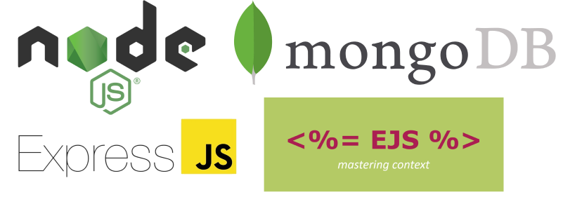
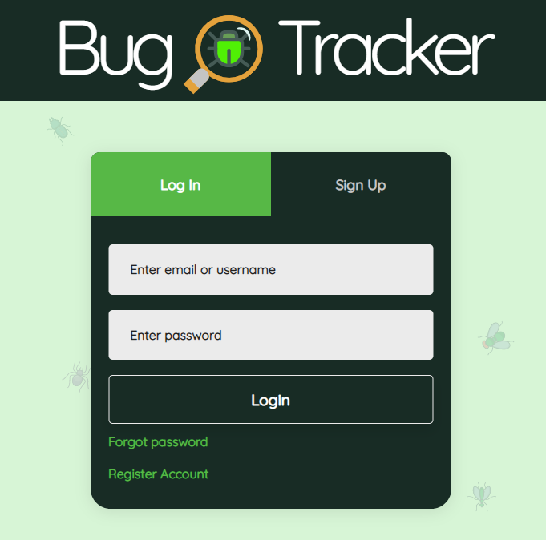

# BugTracker_v1
## Tracks Bugs and Feature Requests for You or Your Organization
## [Live Demo](https://bugtracker-davidlink.herokuapp.com/)
## What's It Do? 🤷‍♀️
### A.&nbsp;&nbsp;&nbsp;&nbsp;Create Projects and Associated Tickets to Track Bugs / Feature Requests. 
### B.&nbsp;&nbsp;&nbsp;&nbsp;3 Permission Levels: Admin | Project Manager | Developer:

### Technologies:

### App:

### Features ✔️
- Login & Registration
- **Cascading Permissions** (Came up with this idea, and it worked. Kind of proud of it.)
- Manually Cascaded Editing
- Manually Cascaded Deletion
- Basic Error Handling
- Database Seeder

### Permissions 🔑
#### Admins can CRUD:
- Users
- Projects
- Tickets
#### Project Managers can CREATE|READ and if Assigned or the Project Owner they can UPDATE|DELETE:
- Projects
- Tickets
#### Developer can CREATE|READ and if Assigned or Ticket Owner they can UPDATE|DELETE:
- Tickets

### Future Fixes? 🛠
- Using Change Streams to organize Backend / better cascading for updates
- Adding Comments
- Bundling Software
- General Organization of Code (Using Sass, etc)
